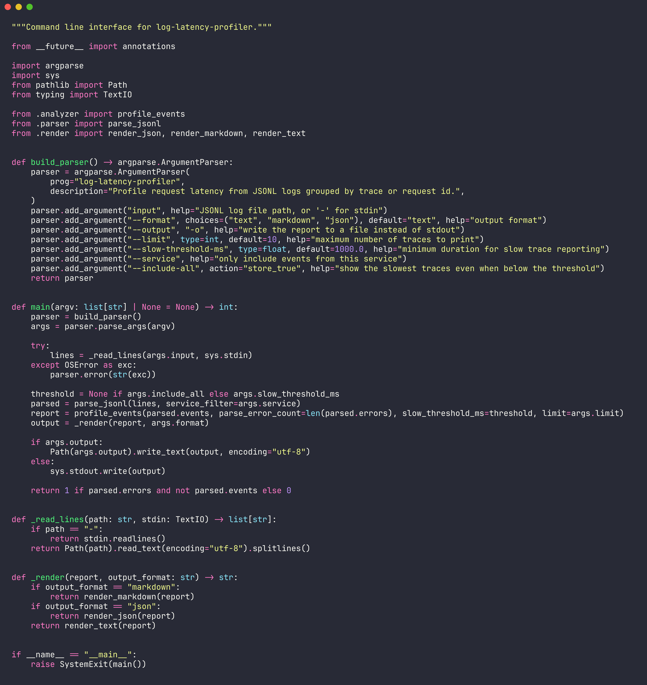
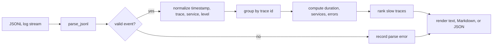

# log-latency-profiler

Profile JSONL application logs by trace/request id. Find slow requests, error-heavy traces, and service paths without sending logs to a SaaS dashboard.




## Why it exists

| Problem | What this does |
|---|---|
| Logs are scattered by service | Groups events by `trace_id`, `request_id`, or `correlation_id` |
| Slow requests hide in noise | Sorts traces by computed duration |
| Incident notes need evidence | Exports clean terminal, Markdown, or JSON reports |
| Logs contain mixed schemas | Detects common timestamp, trace, service, level, and message fields |

## Quick Start

```bash
python3 -m pip install -e .
log-latency-profiler examples/sample.jsonl --include-all
log-latency-profiler examples/sample.jsonl --format markdown -o report.md
```

## CLI Reference

| Argument | Default | Purpose |
|---|---:|---|
| `input` | required | JSONL file path, or `-` for stdin |
| `--format` | `text` | Output as `text`, `markdown`, or `json` |
| `--output`, `-o` | stdout | Write the report to a file |
| `--limit` | `10` | Maximum traces to display |
| `--slow-threshold-ms` | `1000` | Minimum duration for slow trace reporting |
| `--service` | all | Include events from one service only |
| `--include-all` | off | Show slowest traces even below threshold |

## Workflow



## Input Shape

```json
{"timestamp":"2026-05-10T08:00:00Z","trace_id":"checkout-1","service":"api","level":"info","message":"request accepted"}
{"timestamp":"2026-05-10T08:00:01.850Z","trace_id":"checkout-1","service":"api","level":"info","message":"response sent"}
```

## Output

```text
log latency profile
traces: 2 | events: 7 | parse errors: 0
latency ms: min=110.0 median=980.0 p95=1763.0 max=1850.0
```

## Project Layout

| Path | Role |
|---|---|
| `src/log_latency_profiler/parser.py` | JSONL parsing and schema detection |
| `src/log_latency_profiler/analyzer.py` | Trace grouping and latency statistics |
| `src/log_latency_profiler/render.py` | Terminal, Markdown, and JSON output |
| `src/log_latency_profiler/cli.py` | Argument parsing and command orchestration |
| `tests/` | Unit tests with the standard library |
| `examples/` | Sample logs for demos |

## Test

```bash
PYTHONPATH=src python3 -m unittest discover -s tests
```

## License

MIT
