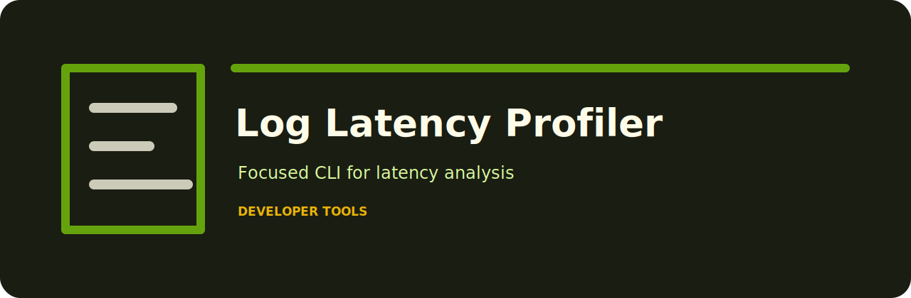

# Log Latency Profiler

Profile request latency from JSONL application logs.

## Working shape

The repo is meant to be opened, understood, and run quickly. The command surface is deliberately narrow: `log-latency-profiler`.

## Fresh clone

```bash
git clone https://github.com/mertefekurt/log-latency-profiler.git
cd log-latency-profiler
python -m venv .venv
source .venv/bin/activate
python -m pip install -e ".[dev]"
```

## First command

```bash
log-latency-profiler examples/sample.jsonl
```

## Local confidence

```bash
ruff check .
pytest
python -m log_latency_profiler --help
```
