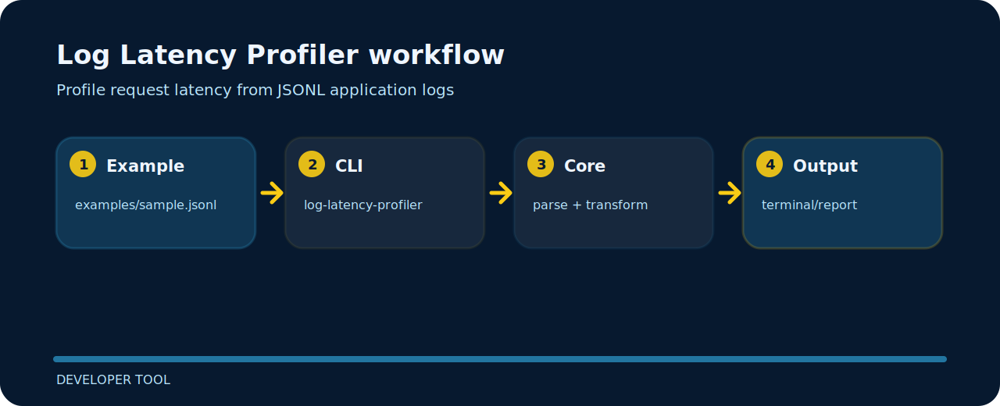

# Log Latency Profiler

| Detail | Value |
| --- | --- |
| Area | developer tool |
| Entry | `log-latency-profiler` |
| Input | JSONL records |
| Output | readable terminal output |


## What to notice

Log Latency Profiler focuses on one practical job in developer tool. The README below is arranged around the shortest path from clone to result.

## Try the sample

```bash
git clone https://github.com/mertefekurt/log-latency-profiler.git
cd log-latency-profiler
python -m pip install -e ".[dev]"
log-latency-profiler examples/sample.jsonl
```

## Visual route



## Before a release

```bash
ruff check .
pytest
python -m log_latency_profiler --help
```
